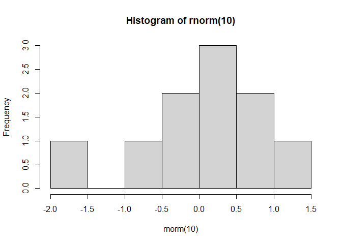

stat 433 test
================
Graham Miotke
9/16/2021

1)  make a new Rmarkdown file
2)  change output to `github_document`
3)  save file as README.Rmd

<!-- end list -->

``` r
hist(rnorm(10))
```

<!-- -->
